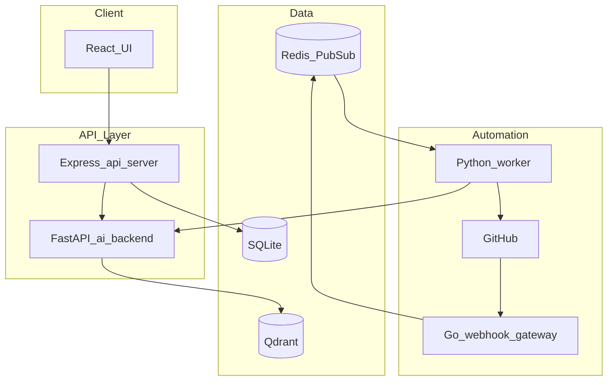
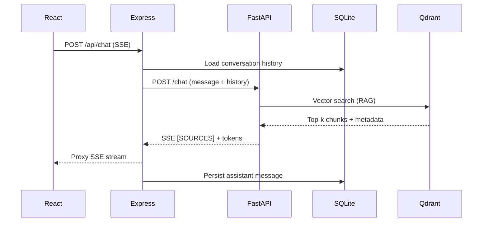
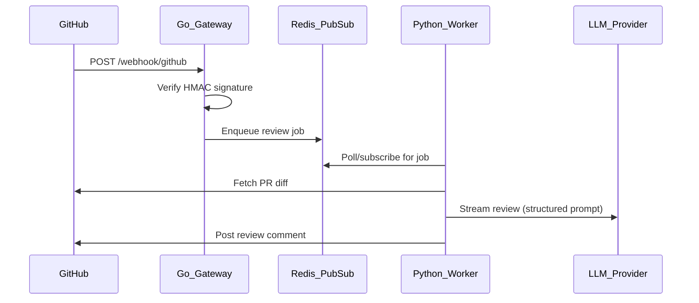

# DevMind Architecture

This document explains how DevMind is structured, why services are split the way they are, and how the system handles failure and scale.

## System overview

## Service boundaries

| Service | Language | Responsibility | Why this language |
|---------|----------|----------------|-------------------|
| **Frontend** | React/TS | Chat UI, PR review UI, auth flows | Rich component ecosystem, SSE streaming client |
| **api-server** | Express/TS | OAuth, sessions, billing, chat proxy, conversation CRUD | Shared TypeScript types with frontend; Drizzle ORM for user data |
| **ai-backend** | Python/FastAPI | LLM orchestration, RAG, SSE token streaming | Best SDK support for Anthropic/OpenAI/Gemini/Vertex |
| **gateway** | Go | GitHub webhook ingestion, signature verification, job enqueue | Small static binary, fast cold starts on Cloud Run |
| **worker** | Python | PR diff fetch, LLM review, GitHub comment posting | Reuses ai-backend LLM and prompt modules |

The split follows a simple rule: **user-facing CRUD and auth in TypeScript**, **AI and automation in Python**, **high-throughput webhook ingress in Go**.

## Chat flow

Key details:

1. The Express api-server acts as an **auth and persistence layer** — it checks usage quotas, loads/saves conversation history, and proxies the SSE stream from FastAPI.
2. RAG search runs before LLM streaming. If Qdrant is unavailable, the chat route logs a warning and continues without context (non-blocking failure).
3. Retrieved sources are emitted as an SSE meta token (`[SOURCES:...]`) so the frontend can show citations without polluting the message body.

## PR review flow

Key details:

1. **Signature verification** happens in Go middleware before any job is enqueued — invalid webhooks are rejected with 401.
2. The queue decouples webhook receipt from LLM processing, so slow reviews never cause GitHub webhook timeouts.
3. Reviews use a structured markdown prompt with severity labels (Critical / Suggestion / Nit) for consistent output.

## Failure modes

| Failure | Behavior |
|---------|----------|
| Qdrant unreachable | Chat continues without RAG context; warning logged |
| LLM provider timeout | SSE stream ends with error; partial response may be saved |
| Invalid webhook signature | 401 response; no job enqueued |
| Monthly chat quota exceeded | 402 from api-server before reaching ai-backend |
| Worker crash mid-review | Job can be retried from queue (at-least-once delivery) |

## Data stores

| Store | Used for | Tradeoff |
|-------|----------|----------|
| **SQLite** (via Drizzle) | Users, sessions, conversations, billing | Simple for portfolio/single-instance; would migrate to Postgres for multi-instance |
| **Qdrant** | Vector embeddings for RAG | Self-hosted or cloud; Vertex Vector Search available as alternative |
| **Redis / PubSub** | PR review job queue | Redis for local dev; Google Pub/Sub in production on GCP |

## Scale path (10k users)

What would change at higher scale, without rewriting the architecture:

1. **SQLite → Postgres** — Required once api-server runs multiple Cloud Run instances (session/conversation consistency).
2. **Rate limiting** — Per-user token bucket on `/api/chat` and `/review` endpoints.
3. **Worker pool** — Horizontal scaling of Python workers with Pub/Sub consumer groups.
4. **Embedding cache** — Cache query embeddings in Redis to avoid re-computing identical searches.
5. **Connection pooling** — PgBouncer for Postgres, Redis connection pool tuning.
6. **CDN for frontend** — Static assets served from Cloud CDN / Cloud Storage.

## Deployment (GCP)

Production runs on **Cloud Run** with four services:

- `devmind-frontend` — React static build
- `devmind-api-server` — Express (auth, billing, chat proxy)
- `devmind-ai-backend` — FastAPI (LLM + RAG)
- `devmind-gateway` + `devmind-ai-worker` — Webhook + background review

Secrets are loaded from **Secret Manager** (`USE_GCP_SECRETS=true`). Structured JSON logs go to **Cloud Logging**. Cloud Build configs live in `ai-backend/cloudbuild*.yaml`.

## Key design tradeoffs

| Decision | Chosen | Alternative | Rationale |
|----------|--------|-------------|-----------|
| Monorepo | pnpm + Go module + Python venv | Separate repos | Easier to demo as one project; shared OpenAPI spec |
| Chat persistence | Express api-server (SQLite) | Direct FastAPI SQLite | Keeps auth/quota/billing in one layer |
| RAG store | Qdrant | Pinecone, pgvector | Self-hostable, good local dev experience |
| LLM abstraction | Provider interface in Python | LiteLLM | Lightweight; only 4 providers needed |
| PR output format | Structured markdown | JSON schema output | Simpler to render; severity parsed on frontend |

## Related files

- Chat route: `ai-backend/routes/chat.py`
- RAG service: `ai-backend/services/rag.py`
- Webhook middleware: `middleware/verify.go`
- Review prompts: `ai-backend/services/review_prompt.py`
- Chat proxy: `artifacts/api-server/src/routes/chat.ts`
- Frontend hooks: `artifacts/frontend/src/hooks/use-chat.ts`
