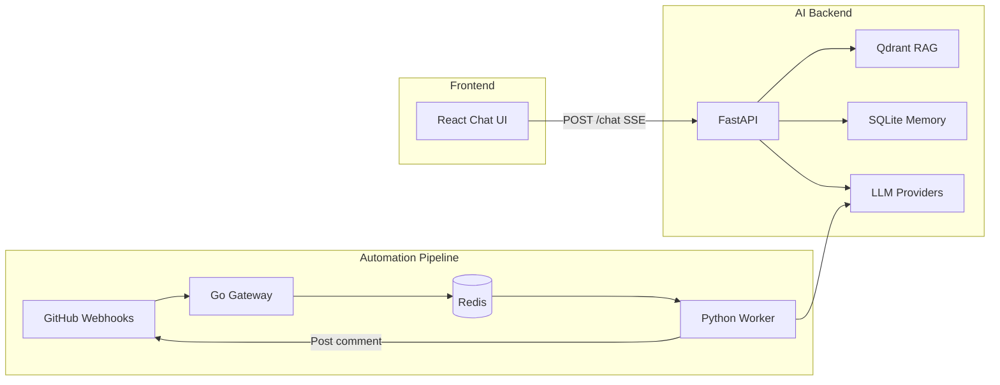

# DevMind

**AI developer assistant with RAG-powered chat and automated GitHub PR reviews.**

[**Live demo**](https://devmind-frontend-nvnmzcvgva-uc.a.run.app) · [Architecture deep-dive](./ARCHITECTURE.md)

DevMind is a full-stack AI platform: users chat with retrieval-augmented context, and GitHub pull requests trigger an async review pipeline that posts structured feedback. Built as a polyglot monorepo spanning Go, Python, and TypeScript.

## Why I built this

Most portfolio chat apps stop at a prompt box. I wanted to demonstrate how real AI products are structured — async job processing, vector search, multi-provider LLM routing, auth, usage limits, and production deployment — in one cohesive system I can walk through in a system-design interview.

## Engineering highlights

- **Polyglot monorepo** — Go webhook gateway, Python FastAPI (LLM + RAG), Express api-server (auth/billing), React frontend
- **Event-driven PR pipeline** — GitHub webhook → Redis/PubSub queue → background worker → GitHub comment
- **RAG with source citations** — Qdrant vector search injects context into chat; users can inspect retrieved chunks
- **Multi-provider LLM routing** — Claude, Gemini, OpenAI, and Vertex AI via a pluggable provider interface
- **Product features** — OAuth (Google/GitHub), conversation history, usage quotas, Razorpay billing
- **GCP deployment** — Cloud Run services with Secret Manager, structured logging, and Cloud Build CI

## Screenshots

Add PNGs to [`docs/screenshots/`](docs/screenshots/) and embed them here:

| Chat | PR Review | Architecture |
|------|-----------|--------------|
| `docs/screenshots/chat.png` | `docs/screenshots/pr-review.png` | `docs/screenshots/architecture.png` |

## Interview talking points

- **Service boundaries** — Why Go handles webhooks (fast, static binary) while Python owns LLM/RAG (rich SDK ecosystem)
- **Reliability** — Webhook signature verification, non-blocking RAG failures, async workers with retries
- **RAG design** — Chunking strategy, embedding provider abstraction, source metadata for user transparency
- **Scale path** — Connection pooling, rate limits, dedicated worker pools, embedding cache at 10k users

## Tech stack

| Layer | Technologies |
|---|---|
| Gateway | Go, chi, Redis / PubSub |
| AI Backend | Python, FastAPI, Anthropic/OpenAI/Gemini/Vertex SDKs, Qdrant, sentence-transformers |
| Frontend | React 19, Vite, Tailwind CSS, Radix UI |
| API Server | Express 5, Drizzle ORM, Pino |
| Tooling | pnpm workspaces, TypeScript, GitHub Actions CI |

## Architecture



See [ARCHITECTURE.md](./ARCHITECTURE.md) for detailed flows, failure modes, and tradeoffs.

### How it works

1. **Chat flow** — The frontend sends messages to the AI backend. The backend loads recent history from SQLite, optionally retrieves context from Qdrant, and streams tokens from the selected LLM provider.
2. **PR review flow** — GitHub sends `pull_request` or `push` events to the Go gateway. The gateway verifies the webhook signature, enqueues a job in Redis, and the Python worker picks it up, fetches the PR diff, generates a review, and posts it as a GitHub comment.

## Features

- **Streaming chat** — Real-time responses over Server-Sent Events (SSE) with support for Claude, Gemini, and OpenAI
- **RAG context** — Ingest documents into Qdrant and retrieve relevant chunks during chat
- **Conversation memory** — Per-user chat history stored in SQLite
- **Automated PR reviews** — GitHub webhooks trigger background workers that fetch diffs, run LLM reviews, and post comments
- **Multi-provider LLM routing** — Switch providers via environment config or per-request selection

## Project structure

```
Dev-Mind/
├── main.go                 # Go gateway entry point
├── handlers/               # GitHub webhook handler
├── middleware/             # Webhook signature verification
├── queue/                  # Redis job queue
├── models/                 # Shared Go structs
├── ai-backend/             # Python FastAPI service + worker
│   ├── main.py             # API server
│   ├── worker.py           # Background PR review worker
│   ├── routes/             # chat, ingest, health
│   └── services/           # LLM, RAG, memory, GitHub
├── artifacts/
│   ├── frontend/           # React + Vite chat UI
│   ├── api-server/         # Express API (health checks)
│   └── mockup-sandbox/     # UI sandbox
├── lib/                    # Shared TypeScript packages
│   ├── api-spec/           # OpenAPI specification
│   ├── api-zod/            # Generated Zod schemas
│   ├── api-client-react/   # Generated React Query client
│   └── db/                 # Drizzle ORM schema
└── scripts/                # Workspace utility scripts
```

## Prerequisites

- [Go](https://go.dev/) 1.22+
- [Python](https://www.python.org/) 3.11+
- [Node.js](https://nodejs.org/) 20+ and [pnpm](https://pnpm.io/)
- [Redis](https://redis.io/) (job queue)
- [Qdrant](https://qdrant.tech/) (vector store for RAG)

## Getting started

### 1. Clone and install dependencies

```bash
git clone <repository-url>
cd Dev-Mind

# Node.js workspace
pnpm install

# Python backend
cd ai-backend
python -m venv .venv
source .venv/bin/activate   # Windows: .venv\Scripts\activate
pip install -r requirements.txt
cd ..

# Go gateway
go mod download
```

### 2. Configure environment

Copy the example env files and fill in your values:

```bash
cp .env.example .env
```

**Root / gateway** (`.env`):

| Variable | Description |
|---|---|
| `GITHUB_WEBHOOK_SECRET` | Secret used to verify GitHub webhook signatures |
| `REDIS_URL` | Redis address (e.g. `localhost:6379`) |
| `PORT` | Gateway port (default `8080`) |

**AI backend** (`ai-backend/.env`):

| Variable | Description |
|---|---|
| `ANTHROPIC_API_KEY` | Anthropic API key (for Claude) |
| `OPENAI_API_KEY` | OpenAI API key |
| `GEMINI_API_KEY` | Google Gemini API key |
| `DEFAULT_LLM_PROVIDER` | Default provider: `claude`, `gemini`, `openai`, or `vertex` |
| `REDIS_URL` | Redis URL (e.g. `redis://localhost:6379`) |
| `QDRANT_URL` | Qdrant server URL (e.g. `http://localhost:6333`) |
| `QDRANT_API_KEY` | Qdrant API key (optional for local dev) |
| `GITHUB_TOKEN` | GitHub PAT for fetching diffs and posting PR comments |
| `PORT` | AI backend port (default `8001`) |

**Frontend** — set `VITE_API_URL` to point at the AI backend (e.g. `http://localhost:8001`).

### GCP / Vertex AI (optional)

For production on Google Cloud, run the one-time setup script:

```bash
chmod +x scripts/gcp/setup-project.sh
./scripts/gcp/setup-project.sh <your-gcp-project-id>
```

Then configure these in `.env`:

| Variable | Description |
|---|---|
| `GCP_PROJECT_ID` | GCP project ID |
| `GCP_REGION` | Vertex AI region (default `us-central1`) |
| `GOOGLE_APPLICATION_CREDENTIALS` | Service account JSON path (local dev only) |
| `DEFAULT_LLM_PROVIDER` | Set to `vertex` for Vertex AI Gemini |
| `VERTEX_MODEL` | Vertex model ID (default `gemini-2.0-flash-001`) |
| `EMBEDDING_PROVIDER` | `local` (default) or `vertex` |
| `VECTOR_STORE` | `qdrant` (default) or `vertex` |
| `USE_GCP_SECRETS` | `true` to load API keys from Secret Manager |
| `USE_GCP_LOGGING` | `true` for structured JSON logs to Cloud Logging |

Deploy to Cloud Run:

```bash
gcloud builds submit --config ai-backend/cloudbuild.yaml
```

For Vertex AI Vector Search, run `./scripts/gcp/setup-vector-index.sh <project-id>` and set `VECTOR_STORE=vertex`, `EMBEDDING_PROVIDER=vertex`, `VERTEX_INDEX_ENDPOINT`, and `VERTEX_DEPLOYED_INDEX_ID`.

### 3. Start infrastructure

Make sure Redis and Qdrant are running locally (or update the URLs in your env files to point at hosted instances).

```bash
# Example with Docker
docker run -d --name redis -p 6379:6379 redis:7
docker run -d --name qdrant -p 6333:6333 qdrant/qdrant
```

### 4. Run the services

Open separate terminals for each service:

```bash
# Terminal 1 — Go gateway (webhooks)
go run main.go

# Terminal 2 — AI backend API
cd ai-backend
source .venv/bin/activate
uvicorn main:app --reload --port 8001

# Terminal 3 — PR review worker
cd ai-backend
source .venv/bin/activate
python worker.py

# Terminal 4 — Frontend
cd artifacts/frontend
PORT=5173 BASE_PATH=/ VITE_API_URL=http://localhost:8001 pnpm dev
```

## API reference

### AI Backend (FastAPI)

| Method | Path | Description |
|---|---|---|
| `GET` | `/health` | Health check |
| `GET` | `/providers` | List available LLM providers |
| `POST` | `/chat` | Stream a chat response (SSE) |
| `POST` | `/chat/clear` | Clear chat history for a user |
| `POST` | `/ingest` | Index text into Qdrant for RAG |

**Chat request example:**

```bash
curl -N -X POST http://localhost:8001/chat \
  -H "Content-Type: application/json" \
  -d '{"message": "Explain React Server Components", "user_id": "user-1", "provider": "claude"}'
```

**Ingest example:**

```bash
curl -X POST http://localhost:8001/ingest \
  -H "Content-Type: application/json" \
  -d '{"text": "Your documentation or code context here", "metadata": {"source": "readme"}}'
```

### Go Gateway

| Method | Path | Description |
|---|---|---|
| `GET` | `/health` | Health check |
| `POST` | `/webhook/github` | GitHub webhook endpoint (signature verified) |

Configure your GitHub repository webhook to point at `https://<your-host>/webhook/github` with events `pull_request` and `push`.

## Development

### Type checking

```bash
pnpm run typecheck
```

### Tests

```bash
go test ./...
cd ai-backend && pytest
cd artifacts/frontend && pnpm test
```

### Build

```bash
pnpm run build
```

### Workspace packages

The TypeScript packages under `lib/` are generated and shared across artifacts:

- `api-spec` — OpenAPI source of truth
- `api-zod` — Zod schemas generated from the spec
- `api-client-react` — React Query hooks generated from the spec
- `db` — Drizzle ORM database schema

## License

MIT
